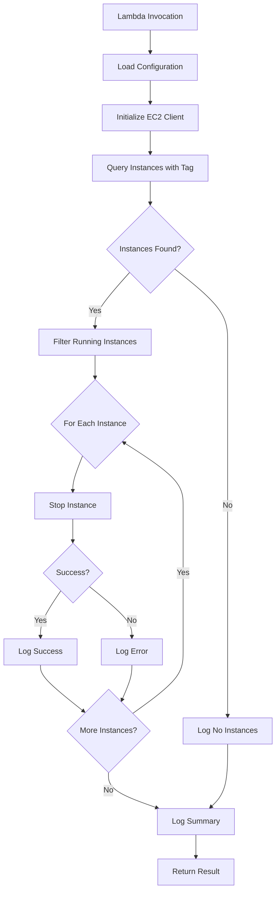

# Design Document: EC2 Auto-Shutdown Lambda

## Overview

This design specifies an AWS Lambda function that automatically stops EC2 instances tagged with `AutoShutdown=yes`. The function uses the AWS SDK for Python (boto3) to interact with EC2 APIs, implements robust error handling with exponential backoff for throttling, and provides comprehensive logging for audit and troubleshooting purposes.

The Lambda function will be invoked on a schedule (via EventBridge) or manually, discover all EC2 instances with the specified tag across the configured region, and issue stop commands for running instances. The design emphasizes resilience, observability, and configurability.

## Architecture

### High-Level Flow



### Components

1. **Configuration Manager**: Loads configuration from environment variables with defaults
2. **EC2 Client Wrapper**: Manages boto3 EC2 client with retry logic
3. **Instance Discovery Service**: Queries and filters EC2 instances by tags
4. **Shutdown Orchestrator**: Coordinates the shutdown process for multiple instances
5. **Logger**: Structured logging to CloudWatch Logs

### AWS Services Integration

- **AWS Lambda**: Serverless compute platform for execution
- **Amazon EC2**: Target service for instance management
- **AWS IAM**: Authentication and authorization
- **Amazon CloudWatch Logs**: Log aggregation and storage
- **Amazon EventBridge** (optional): Scheduled invocation trigger

## Components and Interfaces

### 1. Configuration Manager

**Purpose**: Load and validate configuration from environment variables.

**Interface**:
```python
class Configuration:
    tag_key: str          # Default: "AutoShutdown"
    tag_value: str        # Default: "yes"
    region: str           # From AWS_REGION environment variable
    max_retries: int      # Default: 3
    retry_base_delay: float  # Default: 1.0 seconds
    
    @staticmethod
    def load() -> Configuration:
        """Load configuration from environment variables with defaults"""
```

**Behavior**:
- Reads `TAG_KEY`, `TAG_VALUE`, `MAX_RETRIES` from environment variables
- Uses defaults if environment variables are not set
- Reads region from Lambda's `AWS_REGION` environment variable
- Validates that region is not empty

### 2. EC2 Client Wrapper

**Purpose**: Provide a resilient interface to EC2 API with retry logic.

**Interface**:
```python
class EC2ClientWrapper:
    def __init__(self, region: str, max_retries: int, base_delay: float):
        """Initialize EC2 client with retry configuration"""
    
    def describe_instances_by_tag(self, tag_key: str, tag_value: str) -> List[Instance]:
        """Query instances with specified tag using pagination"""
    
    def stop_instance(self, instance_id: str) -> bool:
        """Stop a single instance with retry logic, returns success status"""
```

**Behavior**:
- Uses boto3 paginator for `describe_instances` to handle large result sets
- Implements exponential backoff for throttling errors (RequestLimitExceeded)
- Catches and handles `ClientError` exceptions from boto3
- Returns structured data for upstream processing

### 3. Instance Discovery Service

**Purpose**: Filter and prepare instances for shutdown.

**Interface**:
```python
class InstanceDiscoveryService:
    def __init__(self, ec2_client: EC2ClientWrapper):
        """Initialize with EC2 client wrapper"""
    
    def find_instances_to_stop(self, tag_key: str, tag_value: str) -> List[InstanceInfo]:
        """Find all instances with tag that are in stoppable states"""
```

**Data Structure**:
```python
class InstanceInfo:
    instance_id: str
    instance_name: str  # From 'Name' tag, or empty string
    state: str          # Current instance state
```

**Behavior**:
- Queries EC2 for instances with the specified tag
- Filters instances to only include those in "running" state
- Excludes instances in "stopped", "stopping", "terminated", "terminating" states
- Extracts instance name from 'Name' tag if present

### 4. Shutdown Orchestrator

**Purpose**: Coordinate the shutdown of multiple instances.

**Interface**:
```python
class ShutdownOrchestrator:
    def __init__(self, ec2_client: EC2ClientWrapper, logger: Logger):
        """Initialize with EC2 client and logger"""
    
    def shutdown_instances(self, instances: List[InstanceInfo]) -> ShutdownResult:
        """Stop all instances and return summary"""
```

**Data Structure**:
```python
class ShutdownResult:
    total_instances: int
    successful_stops: int
    failed_stops: int
    errors: List[str]  # Error messages for failed stops
```

**Behavior**:
- Iterates through all instances
- Calls EC2 client to stop each instance
- Continues processing even if individual stops fail
- Collects success/failure statistics
- Logs each operation with appropriate level

### 5. Logger

**Purpose**: Provide structured logging with appropriate levels.

**Interface**:
```python
class Logger:
    def info(self, message: str, **kwargs):
        """Log informational message with optional structured data"""
    
    def warning(self, message: str, **kwargs):
        """Log warning message with optional structured data"""
    
    def error(self, message: str, **kwargs):
        """Log error message with optional structured data"""
```

**Behavior**:
- Uses Python's standard logging module
- Formats messages with JSON structure for CloudWatch Logs Insights
- Includes timestamp, log level, and message
- Supports additional structured fields via kwargs

### 6. Lambda Handler

**Purpose**: Entry point for Lambda execution.

**Interface**:
```python
def lambda_handler(event: dict, context: LambdaContext) -> dict:
    """Main Lambda handler function"""
```

**Behavior**:
- Loads configuration
- Initializes all components
- Orchestrates the shutdown workflow
- Handles top-level exceptions
- Returns structured response with execution summary

## Data Models

### Instance Information
```python
{
    "instance_id": "i-1234567890abcdef0",
    "instance_name": "web-server-01",
    "state": "running"
}
```

### Shutdown Result
```python
{
    "total_instances": 5,
    "successful_stops": 4,
    "failed_stops": 1,
    "errors": ["Failed to stop i-abc123: InsufficientInstanceCapacity"]
}
```

### Lambda Response
```python
{
    "statusCode": 200,
    "body": {
        "message": "Shutdown operation completed",
        "result": {
            "total_instances": 5,
            "successful_stops": 4,
            "failed_stops": 1
        }
    }
}
```

### Configuration
```python
{
    "tag_key": "AutoShutdown",
    "tag_value": "yes",
    "region": "us-east-1",
    "max_retries": 3,
    "retry_base_delay": 1.0
}
```


## Correctness Properties

*A property is a characteristic or behavior that should hold true across all valid executions of a system—essentially, a formal statement about what the system should do. Properties serve as the bridge between human-readable specifications and machine-verifiable correctness guarantees.*

### Property 1: Tag-based instance discovery
*For any* execution of the Lambda function, when querying EC2 instances, the function should call the EC2 API with a filter for the configured tag key and tag value.
**Validates: Requirements 1.1, 1.3**

### Property 2: All tagged running instances receive stop commands
*For any* set of EC2 instances with the AutoShutdown tag, all instances in "running" state should receive stop commands.
**Validates: Requirements 2.1, 2.2**

### Property 3: Non-running instances are excluded
*For any* set of EC2 instances including instances in "stopped", "stopping", "terminated", or "terminating" states, those instances should not receive stop commands.
**Validates: Requirements 2.3, 2.4**

### Property 4: Successful stops are logged with instance details
*For any* instance that is successfully stopped, the logs should contain the instance ID and the stop action.
**Validates: Requirements 2.5**

### Property 5: Individual failures don't prevent other instances from processing
*For any* set of instances where one or more fail to stop, all instances should still be attempted, and failures should be logged without terminating execution.
**Validates: Requirements 3.2, 3.4**

### Property 6: Throttling triggers exponential backoff retry
*For any* EC2 API call that returns a throttling error, the function should retry with exponentially increasing delays up to the configured maximum retry count.
**Validates: Requirements 3.3**

### Property 7: Execution start is logged with configuration
*For any* execution, the logs should contain an entry at the start with the execution timestamp and configured region.
**Validates: Requirements 4.1**

### Property 8: Instance discovery count is logged
*For any* instance discovery operation, the logs should contain the count of instances found with the AutoShutdown tag.
**Validates: Requirements 4.2**

### Property 9: Instance stops are logged with full details
*For any* instance stop operation, the logs should contain the instance ID, instance name (if available), and timestamp.
**Validates: Requirements 4.3**

### Property 10: Errors are logged with structured information
*For any* error that occurs, the logs should contain the error type, error message, and affected resource identifier.
**Validates: Requirements 4.4**

### Property 11: Execution summary is logged at completion
*For any* execution completion, the logs should contain a summary with total instances processed, successful stops, and failed stops.
**Validates: Requirements 4.5**

### Property 12: Log levels are appropriate for message types
*For any* log message, informational messages should use INFO level, warnings should use WARN level, and errors should use ERROR level.
**Validates: Requirements 4.6**

### Property 13: Environment variable overrides are respected
*For any* environment variable setting (tag key, tag value, or retry count), the function should use the specified value instead of the default.
**Validates: Requirements 6.2, 6.3, 6.4**

## Error Handling

### Error Categories

**1. Fatal Errors (Terminate Execution)**
- Authentication failures (invalid credentials)
- EC2 API completely unavailable
- Invalid region configuration
- Missing required IAM permissions for describe_instances

**2. Recoverable Errors (Retry with Backoff)**
- Throttling errors (RequestLimitExceeded)
- Temporary network issues
- Service unavailable (503) responses

**3. Isolated Errors (Log and Continue)**
- Permission errors for specific instances
- Instance-specific stop failures
- Invalid instance states

### Retry Strategy

**Exponential Backoff Configuration**:
- Base delay: 1 second (configurable)
- Maximum retries: 3 (configurable)
- Backoff formula: `delay = base_delay * (2 ^ attempt_number)`
- Delays: 1s, 2s, 4s

**Retry Logic**:
```python
def retry_with_backoff(operation, max_retries, base_delay):
    for attempt in range(max_retries):
        try:
            return operation()
        except ClientError as e:
            if e.response['Error']['Code'] == 'RequestLimitExceeded':
                if attempt < max_retries - 1:
                    delay = base_delay * (2 ** attempt)
                    time.sleep(delay)
                    continue
            raise
```

### Error Response Structure

All errors should be logged with:
- Error type (exception class or AWS error code)
- Error message (human-readable description)
- Resource identifier (instance ID, region, etc.)
- Timestamp
- Request ID (if available from AWS)

## Testing Strategy

### Dual Testing Approach

This feature requires both unit tests and property-based tests for comprehensive coverage:

- **Unit tests**: Verify specific examples, edge cases, and error conditions
- **Property tests**: Verify universal properties across all inputs

Both testing approaches are complementary and necessary. Unit tests catch concrete bugs in specific scenarios, while property tests verify general correctness across a wide range of inputs.

### Property-Based Testing

**Framework**: Use `hypothesis` library for Python property-based testing

**Configuration**:
- Minimum 100 iterations per property test (due to randomization)
- Each property test must reference its design document property
- Tag format: `# Feature: ec2-auto-shutdown, Property {number}: {property_text}`

**Property Test Implementation**:
- Each correctness property listed above must be implemented as a single property-based test
- Use hypothesis strategies to generate random test data (instance lists, configurations, error conditions)
- Mock AWS API responses to test behavior without actual AWS calls

**Example Property Test Structure**:
```python
from hypothesis import given, strategies as st

# Feature: ec2-auto-shutdown, Property 2: All tagged running instances receive stop commands
@given(st.lists(st.builds(InstanceInfo)))
def test_all_running_instances_stopped(instances):
    # Filter to running instances
    running = [i for i in instances if i.state == 'running']
    
    # Execute shutdown
    result = orchestrator.shutdown_instances(instances)
    
    # Verify all running instances received stop commands
    assert len(mock_ec2.stop_calls) == len(running)
```

### Unit Testing

**Focus Areas**:
- Configuration loading with various environment variable combinations
- Specific error scenarios (authentication failure, API unavailable)
- Edge cases (empty instance lists, all instances already stopped)
- Log message formatting and structure
- Pagination handling for large instance sets

**Unit Test Balance**:
- Avoid writing too many unit tests for scenarios covered by property tests
- Focus on integration points between components
- Test specific examples that demonstrate correct behavior
- Validate error conditions and edge cases

### Test Coverage Goals

- 90%+ code coverage
- All correctness properties implemented as property tests
- All error paths tested with unit tests
- Integration test with mocked AWS services
